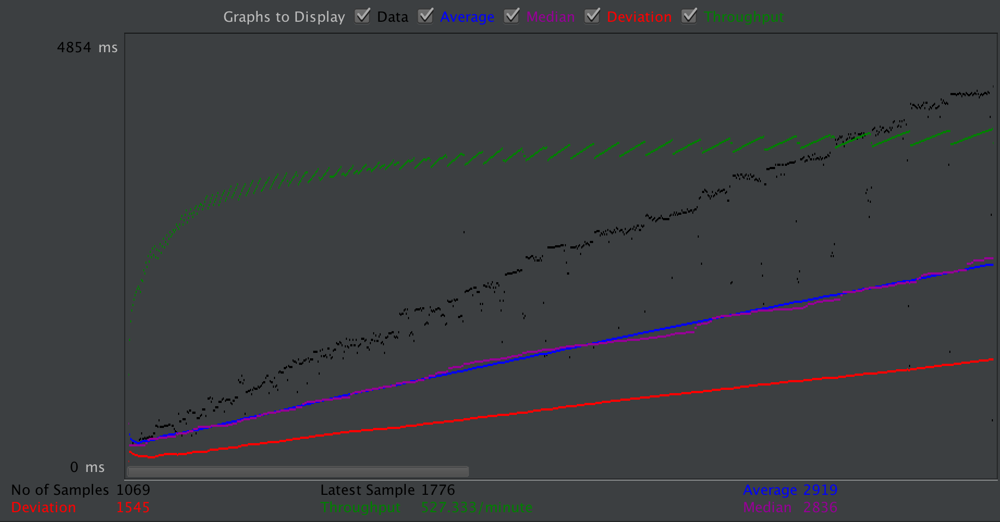
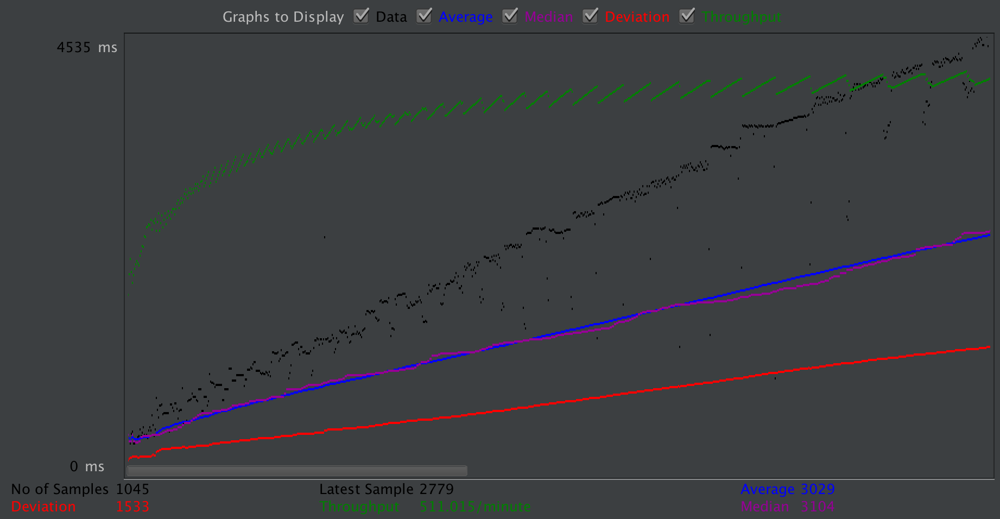
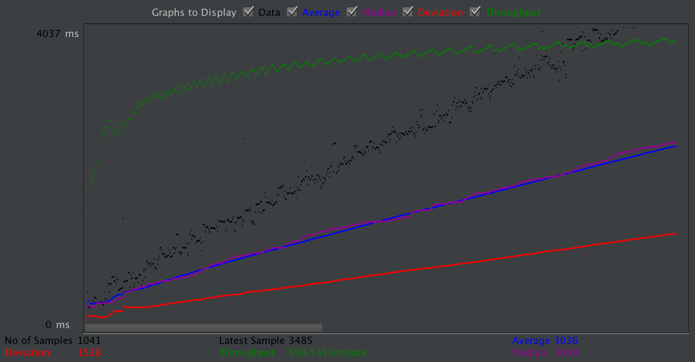
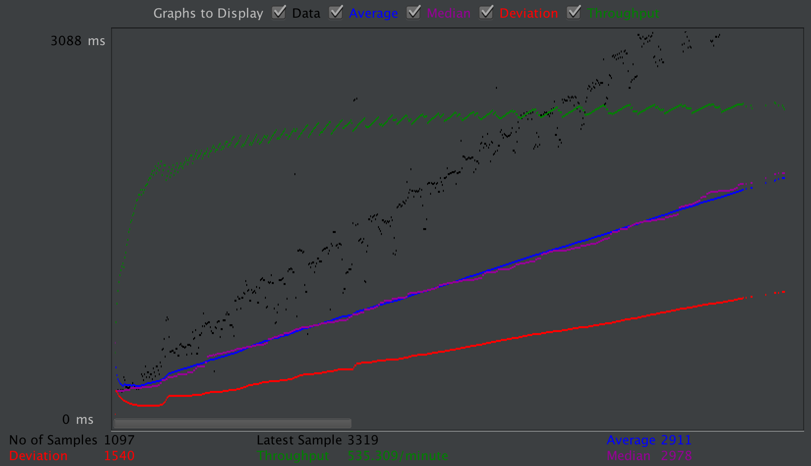
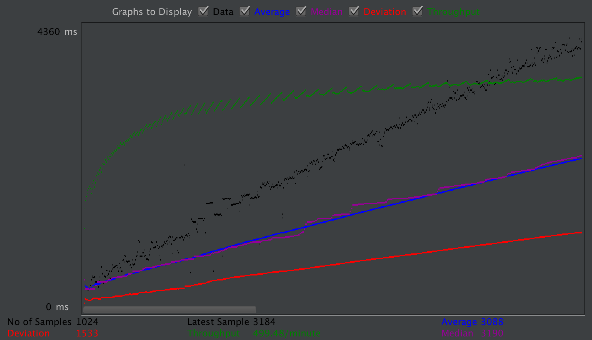
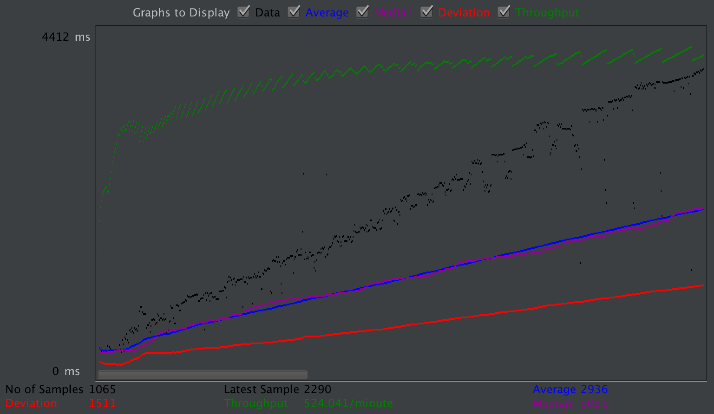

# Performance Testing and Connection Pool Sizes

[HikariCP](https://github.com/brettwooldridge/HikariCP) [became the JDBC default connection pool in Spring Boot 2.0](https://github.com/spring-projects/spring-boot/issues/6013), offering better performance by default. They also have an extremely interesting article on [connection pool sizing](https://github.com/brettwooldridge/HikariCP/wiki/About-Pool-Sizing). I'm also interested in testing the maximum performance of the API so its the perfect time to play with both!

## Performance Testing

Testing the maximum performance of a system is apparently known as a [stress test](https://www.linkedin.com/pulse/performance-load-stress-endurance-test-which-do-you-want-chris-jones/) and is an IEEE standard.

I've heard of [JMeter](https://jmeter.apache.org/) for performance testing, which is the umbrella term for these kinds of tests, but wasn't sure how to do a stress test with it.

On top of that there are a lot of metrics available in JMeter and I wondered how anyone could actually compare the performance of two systems. Could it be by measuring throughpught or response time? And with how many users? Some of those questions are answered [here](https://sqa.stackexchange.com/a/18612).

The answer is to record both your response times and throughpught as you steadily increase the users, which means to increase your requests to the server per minute. This is demonstrated in this [BlazeMeter article](https://www.blazemeter.com/blog/what%E2%80%99s-the-max-number-of-users-you-can-test-on-jmeter) which also answers the question: "how many users can I test with my local machine?".

It says I should be able to handle around the 1000 user mark on my laptop, then I'll have to stop using the GUI and if I still need more then I can use a tool like BlazeMeter. We're only testing the free tier t2.micro instances here today so I think my laptop be up for the task!

The t2 instances are burstable instances which means they can boost their performance until they run out of credits, which are earned when the instance is under minimal load. I thought this might be an issue so I kept an eye on our available CPU credits and was suprirised (and glad) that these tests didn't really drain credits at all. It is important to note that if we did run out of credits, because of sustained load, our performance would be dramatically worse on these instance types.

## Connection Pool Sizes

According to the [HikariCP connection pool sizing article](https://github.com/brettwooldridge/HikariCP/wiki/About-Pool-Sizing), its good to have a small connection pool size which makes sense to me but what I didn't realise is just how small they suggest to go. Without any context I would have said 50-100 is a small amount.

I think for my t2.micro instance it should be around 6. Maybe around 9 for an m4.large. [The formula](https://github.com/brettwooldridge/HikariCP/wiki/About-Pool-Sizing#the-formula). I'm not really sure how to calculate the `effective spindle count` on an AWS RDS and didn't have much google like either so I'm guessing a bit.

## Tests

We'll be testing the tasks endpoint. We'll need to add a header manager to the HTTP Request to add our authorization header so we're authenticated.

I configured the thread group to 50 threads, ramp up period at 120 seconds and test time at 120 seconds.

### Day 1

50 Connections

12 Connections

24 Connections

6 Connections

The results suggest the opposite to the HikariCP article, more connections meant more throughpought. I thought I would try again

### Day 2

6 Connections

50 Connections

50 Connections Run 2

Today less connections meant more performance.

What I've gathered from this is that there wasn't a lot of difference between connection pool sizes, possibly due to my small test duration and/or small instance sizes. I'm not too sure. I decided to stick with a connection pool size because of day 2's promising result and less is more.

## Performance Analysis

Throughpought trends towards a reasonably steady throughought of around 500 requests per minute or 8.33 per second while response time increases almost linearly. This makes sense given a constant throughpought.

To work out how many users our system can support we need to know how often an average user makes a request. I'd say 2000ms per page is a reasonable estimate.

I can use Chrome Dev Tools to throttle my network connection to see what x amount of response times feels like to the user. I'd say 2000ms is right about the tipping point for a bad user experience.

That means each user will make around 1/4000 \* 1000 = 0.25 requests per second.

That means we can support 8.33/0.25 = 33.25 concurrent users on at our performance tipping point. There will be deviation at this number, some better, some worse but we should expect a good user experience under this number.

That doesn't really sound like much but it is in the free tier and that's more than enough to get an MVP going.

I'll be running some tests on bigger instance sizes in the future.
