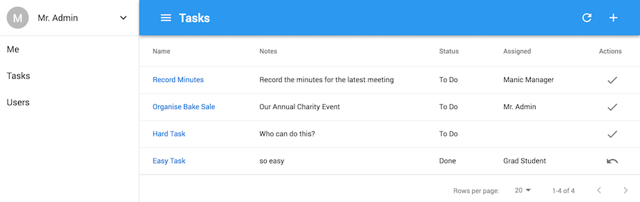

# Glue Stack

My stack of favourite tools and practises glued together to make a multi-tenant todo application where organisations can manage their tasks.

If you're reading this on GitHub, then try our [GitBook](https://cadbox1.gitbook.io/glue-stack/).

## Table of Contents

- [Glue Stack](#glue-stack)
  - [Table of Contents](#table-of-contents)
  - [Why](#why)
  - [Getting Started](#getting-started)
  - [Architecture](#architecture)
  - [Application Features](#application-features)
  - [Managing Resources](#managing-resources)
  - [Tools](#tools)
    - [Stack Tools](#stack-tools)
    - [Development Tools](#development-tools)

## Why

* To share how I build web applications, for both my future self and others.
* Show why I think a monolithic SQL, Java application is still cool.
* Demonstrate my idea of development process documentation.

## Getting Started

* Check out the [app](https://d1if23x0agu0jj.cloudfront.net/).
* We have a [pretty website](https://cadbox1.github.io/glue-stack/).
* Check out our [development process](./Guides/DevelopmentProcess-Tasks.md).
* Check out our [designs](./Design/README.md).
* Check out our [guides](./Guides/README.md).
* [Run locally](./Guides/RunningLocally.md).
* If you're really keen then [build Glue Stack from an empty folder](./Guides/BuildingGlueStackFromAnEmptyFolder.md).

## Architecture

Multitenant, monolithic, 3-tier application with a MySQL database, Spring Boot HTTP API and React Single Page Application.

| Tier/Component                            | Type                            | Language   | Implementation                   |
| ----------------------------------------- | ------------------------------- | ---------- | -------------------------------- |
| DB \(Database\)                           | Relational                      | SQL        | MySQL \(pronounced "my sequel"\) |
| API \(Application Programming Interface\) | JSON over HTTP                  | Java       | Spring Boot                      |
| UI \(User Interface\)                     | SPA \(Single Page Application\) | Javascript | React                            |

Continued at [Design/Architecture](./Architecture.md).

## Application Features

* Sign up your organisation
* Login and Logout
* Manage your assigned tasks
* Manage your organisation's tasks
* Manage your users

## Managing Resources

The term `CRUD` (Create, Rertrieve, Update, Delete) often simplifies the problem. I prefer to think of it as `Managing Resources`

* Operations
  * Retrieval
    * Viewing a single resource
    * Collections
      * Searching
      * Filtering
      * Sorting
      * Pagination
  * Storage
    * Create
    * Edit
    * Delete
* Security
  * Authentication: Users must be logged in so we can check authorisations
  * Authorisation
    * Multi-tenancy: users can only manage resources in their own organisation
    * Permissions: different users can access different resources within their organisation
    * Feature toggles: developers can toggle different features or operations for an organisation

AND Mobile friendly: all operations must work across devices.

The `Managing Resouces` pattern will be used over and over again in our app so it is vital that we design our application to address it, especially the development process documentation.

## Tools

### Stack Tools

Tools that make our application work.

* Database
  * MySQL
* API
  * Java
  * Spring-Boot
  * Hibernate
  * Spring-Security
  * Spring-Data-JPA
* UI
  * React
  * create-react-app
  * Material-UI
  * React-Router-V4

### Development Tools

Tools that we use to develop our application over time.

* Version Control
  * Git
  * Monorepo
  * Git Town: for branching strategy
* Editors
  * Visual Studio Code \(vscode\)
  * Sequel Pro
* Documentation
  * Environment setup
  * How to develop core features given our current stack
* Feature toggles
* Testing
* Deployment
  * Deploy features as soon as they're ready.
  * Flyway for automated database migrations.