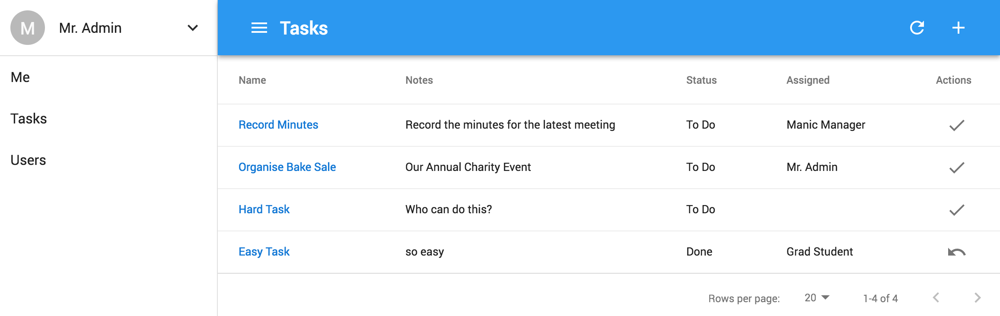

import {
	Hero,
	HeroHeading,
	HeroLead,
	HeroButtons,
	HeroButton,
} from "src/components/Hero";

import {
	Features,
	Feature,
	FeatureHeading,
	FeatureText,
} from "src/components/Features";

<Hero>
	<HeroHeading>Another Todo App</HeroHeading>
	<HeroLead>
		Glue Stack is a task app for teams powered by React, Java, MySQL and
		Kubernetes. Oh, and some{" "}
		<strong>
			<em>serious glue</em>
		</strong>
		.
	</HeroLead>
	<HeroButtons>
		<HeroButton href="https://tasks.cadell.dev/#/signup" variant="primary">
			Signup now!
		</HeroButton>
		<HeroButton href="https://tasks.cadell.dev">Login</HeroButton>
	</HeroButtons>
</Hero>

<Features>
	<Feature>
		<FeatureHeading>Easy to Use</FeatureHeading>
		<FeatureText>
			Glue Stack is designed to nail the basics. That means mobile-first design,
			performance and consistency. Functionality like Search, Filters and
			Sorting come standard.
		</FeatureText>
	</Feature>
	<Feature>
		<FeatureHeading>Scalable Development</FeatureHeading>
		<FeatureText>
			Documentation, Docker and Tests maximise the developer experience.
			Continuously Deploy with GitHub Actions, zero-downtime deploys, a staging
			environment, and feature toggles (coming soon).
		</FeatureText>
	</Feature>
	<Feature>
		<FeatureHeading>Scalable Performance</FeatureHeading>
		<FeatureText>
			Deployed on Kubernetes means high-availability, scaling and self-healing.
			It also means less vendor lockin and a platform for future (micro)
			services. It currently costs ~$60 usd/month on Google Cloud.
		</FeatureText>
	</Feature>
</Features>

